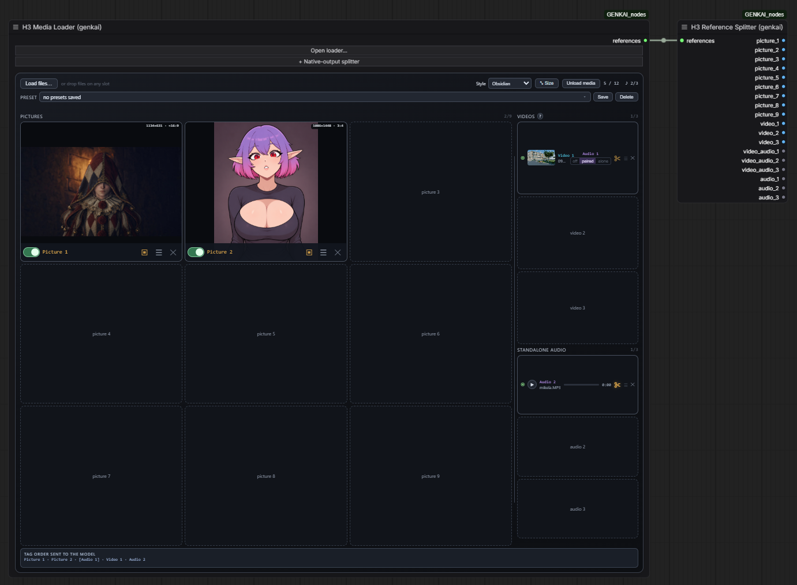

<p align="center">
  <strong>English</strong> &nbsp;|&nbsp; <a href="README.ru.md">Русский</a>
</p>

<h1 align="center">Genkai ComfyUI Nodes</h1>

<p align="center">
  
</p>

<p align="center">
  <a href="https://t.me/genkai_ai"></a>
</p>

## PromptSync

https://github.com/user-attachments/assets/b0ac1e71-b139-49ce-98a5-c3e015adcd86

Watch a generated video alongside its original timed prompt. Check whether actions, camera cuts, and dialogue happen at the intended moments.

- **Left:** video player, clickable timeline markers, and an audio waveform.
- **Right:** the original prompt, preserving its order, spacing, and line breaks. Markdown remains part of the original text.
- The current timed section is highlighted; general camera, style, lighting, and sound directions use a separate color treatment.
- Choose a reading style from **Style** beside **Auto-scroll**. The selection is saved with the workflow and can be changed without restarting playback.
- Optional auto-scroll follows playback.
- Click a time marker or the waveform to seek through the video.
- Drag the node's bottom-right corner to make more room for the player and prompt.

[Supported timing syntax and prompt examples](#supported-timing-syntax)

### Reading styles

Available in **both PromptSync versions**:

| Style | Appearance |
| --- | --- |
| **Spotlight · Serif** (default) | Full-width warm highlight for the active scene, serif text, and a timestamp in the left margin. |
| **Cards · Sans** | Separate scene cards, a sans-serif font, and a gold border around the active card. |
| **Script · Mono** | Compact monospaced text with a blue active-scene background. |
| **Classic · Inline** | Original serif layout with gold highlighting behind active text lines. |

Styles change the presentation, keeping the original prompt text and timing intact.

### Connections

Connect text to `prompt` and **one** video source:

| Input | Source | Behavior |
| --- | --- | --- |
| `video` | A `VIDEO` output, such as Load Video | Creates a temporary MP4 preview, using the source video's audio. |
| `images` | An `IMAGE` frame batch | Creates a temporary MP4 at the selected `fps`; connect `audio` to include sound. |
| `filenames` | VHS Video Combine's `Filenames` output | Reuses the saved video without encoding it again. |

`fps` only applies to `images`. In this version, the separate `audio` input is used when assembling image frames; `video` and `filenames` play the audio already present in the video.

The waveform is decoded locally from the actual audio. A missing audio track and a silent track are labeled separately. Temporary previews may become unavailable after the `temp` directory is cleared.

## PromptSync + Save


A separate output node that combines the PromptSync viewer with video saving through **VHS Video Combine**.

Includes the same [four reading styles](#reading-styles), auto-scroll, and audio waveform, plus **Obsidian**: a near-black theme with graphite controls, cool scene highlights and a sans-serif font. [See supported timing syntax and examples](#supported-timing-syntax).

Connect `prompt` and one source: `images`, `video`, or `filenames`. For latents on `images`, also connect `vae`. The `audio` input adds sound to image frames or overrides the source video's audio.

Each completed save keeps **one final MP4**. Metadata is embedded when `save_metadata` is enabled (the default): no separate metadata PNG or silent intermediate remains alongside the result. If neither the source nor the `audio` input provides sound, the result has no audio track.

The `Filenames` output is compatible with `VHS_FILENAMES` and contains only the final video's path. Previously saved results are not deleted.

### Playback and workflow statistics

- **Collapsible Save settings:** expand to adjust encoding and playback options, then hide them to give the viewer more room. The open/closed state is saved with the workflow.
- **Autoplay and repeat:** a newly received video starts automatically. **Repeat preview → Loop** is the default and repeats until you pause it; choose **Once** for a single playback. This does not add repetitions to the saved file.
- **Remembered volume:** starts at **25%**. Your selected level persists between generations and is saved with the workflow.
- **Sound only on hover:** the default **Hover** mode enables sound over the video preview. Choose **Always** to keep sound on away from the preview. This setting affects playback only. Browsers may require an initial interaction before allowing audible autoplay.
- **Labeled details below the waveform:** playback position and duration, video resolution, complete workflow execution time, and execution time per second of video, in a larger, left-aligned font.

The built-in timer measures from ComfyUI's execution start to workflow completion, including saving, excluding queue waiting time. **Time per video second = workflow execution time ÷ video duration.** It measures the current run, so cached work can make the result faster; it does not isolate the model's generation time. Keep the interface connected during the run to capture the timing. Results are retained when you save the workflow; older previews without a recorded measurement show a dash. No separate timer node or extra timer package is required.

### Save settings

Open **Save settings** above the viewer to reveal these controls:

| Setting | Purpose |
| --- | --- |
| `frame_rate` | Output FPS. Match an existing video's original FPS to preserve its speed and prompt timing. |
| `loop_count` | Additional repetitions in the saved file. `0`: no extra repeat; `1`: play the sequence twice. |
| `filename_prefix` | Filename and subfolder relative to `output` or `temp`. Date tokens such as `GENKAI/%date:yyyy-MM-dd%/%date:hhmmss%` work when queued from the ComfyUI interface. |
| `format` | MP4 with H.264 or H.265. H.264 is preferred for browser playback compatibility. |
| `pix_fmt` | `yuv420p` or `yuv420p10le`; supported combinations depend on the codec and FFmpeg build. |
| `crf` | Compression level. Lower values mean higher quality and larger files. Default: `19`. |
| `save_metadata` | Enabled by default; can be switched off. Embeds the available workflow, generation parameters, and original timed prompt when enabled. |
| `trim_to_audio` | Trims the video to audio using VHS. |
| `pingpong` | Adds reversed frames after the forward sequence in the saved video (boomerang). Audio is not reversed. |
| `save_output` | `true`: save in `output`; `false`: save in `temp`. |
| **Sound only on hover** | Preview sound: **Hover** (default) or **Always**. |
| **Repeat preview** | Preview playback: **Loop** (default) or **Once**. |

When metadata saving is enabled, the original timed prompt is stored as `genkai_timed_prompt` metadata. Existing videos are decoded and encoded again when saved. Looping and `pingpong` change the duration without automatically rewriting the prompt's timestamps.

### VHS Batch Manager

The `meta_batch` input supports processing image/latent batches in parts. Set `loop_count=0` and `pingpong=false`.

**Automatic requeue requires support in VHS.** In VHS versions where `requeue_workflow` in `videohelpersuite/utils.py` only counts `VHS_VideoCombine` output nodes, add `GenkaiVideoPromptViewerSave` to that list. This package does not patch VHS automatically. Ordinary saves without `meta_batch` do not need this change. Check compatibility again after updating VHS.

## H3 Media Loader + H3 Reference Splitter



Keep your image, video and audio references together in one panel. Connect **H3 Media Loader** to **H3 Reference Splitter** with a single link to use the media as separate outputs in your workflow.

- **Nine image slots, three video slots and three standalone audio slots**, with previews and individual enable switches.
- Load files through the file picker or drag-and-drop. Hover over a slot and press **Ctrl+V** to paste an image.
- Drag references between slots: an occupied slot swaps with the source; an empty slot receives the reference and leaves its previous position empty. Moving media does not change its data type.
- Crop, rotate or mirror pictures; trim video/audio, capture frames and extract audio. Video sound can be off, paired with the video or used separately.
- Save named media presets and restore reference sets later.
- Choose **Original**, **Gold** (default), **Obsidian**, **Light Studio** or **High Contrast**. Large image switches and aligned action buttons make the slots easier to use.
- Drag the divider to give either column more space. **Resize contents with node** is enabled by default in **Size**, so the panel follows the node's size.
- Click **+ Native-output splitter** to add and connect the second node automatically.

The loader outputs an `H3_REFS` bundle. The splitter provides `picture_1`–`picture_9` and `video_1`–`video_3` as `IMAGE` data, plus `video_audio_1`–`video_audio_3` and `audio_1`–`audio_3` as `AUDIO`. Disabled references are skipped; references of each type follow the visual slot order. The original H3 reference/audio limits still apply.

Based on the MIT-licensed media nodes by [Adudeguyman](https://github.com/Adudeguyman/ComfyUI-Fantastic-MiniMaxH3-PromptBuilder), with GENKAI interface additions. All required loader and splitter code is included in this pack; the original pack does not need to be installed.

[Example workflow](examples/Media%20Bank%20and%20Reference%20Splitter.json) · [More details](README_MediaBank.md)

## Folder Search


Find files in a directory and pass the results to the next node. Useful for processing a collection of images, videos, or other files one at a time.

- `folder_path`: directory to search.
- `search_mask`: a pattern such as `*.mp4`, `*.png`, or `*.*`.
- `output_type`: return the entire list (`Full file list`) or one path per execution (`Current file`).
- `recursive`: include subfolders.
- `include_directories`: include directories in the results.
- `return_full_path`: return absolute paths.
- `relative_filenames`: return paths relative to the search directory when full paths are disabled.
- `infinite_loop`: immediately return to the first file after the last result in single-file mode.
- `save_output_to`: optional text file for writing the found paths.

The `output` contains a list or a string, depending on the mode. Without `infinite_loop`, the node returns an empty string after the last result; the next execution starts a new pass. It advances when executed, but does not queue ComfyUI runs by itself. Results follow filesystem traversal order without additional sorting.

## Image Expand With Fill


Expand the canvas by adding pixels on the `left`, `right`, `top`, and `bottom`. Works with individual images and `IMAGE` batches.

- `stretch_fill=true`: extend the image's border pixels outward.
- `stretch_fill=false`: fill the added area with zeros, producing black borders for ordinary RGB images.
- `image` output: the expanded image.

The original image area is not resized. This node does not perform generative outpainting or invent new details. Expansion converts through an 8-bit image; with all padding values set to zero, the input is returned without this conversion.

## Seed Slots

https://github.com/user-attachments/assets/5607fd79-25a7-4cc7-8aac-1713e3511ed5

A slot-machine seed generator made to **add a little fun to ComfyUI**. Spin the reels, collect combinations and use the resulting seed in your generation.

- Outputs an `INT` seed from **0 to 9,999,999,999**. Connect it to the sampler's seed input.
- Each workflow execution draws a new seed while **Lock seed** is off. Turn the lock on to reuse the displayed number.
- **SPIN** and the lever let you try a draw without running the workflow. Lock a number you like before generating; otherwise the next execution draws again.
- Combinations earn points, with a score for the current draw and a running total. Open **COMBINATIONS & POINTS** to see the scoring rules.
- Animated perimeter lights celebrate combinations; new draws scoring **more than 50** also launch confetti. Optional sound is off by default.
- Expand **RECENT SEEDS** to see the last 50 results, their date/time and score. Click one to restore and lock it, or enter a seed manually.
- Seed, lock state, history and total score are stored with the workflow. The animation does not delay generation.

The score is just for fun and does not affect image or video quality.

[Example workflow](examples/Seed%20Slots%20Example.json) · [Controls and scoring details](README_SeedSlots.md)

## Installation

Run this inside `ComfyUI/custom_nodes`:

```bash
git clone https://github.com/GENKAIx/Genkai-ComfyUI-Nodes.git
```

Restart ComfyUI and refresh your browser with **Ctrl+F5**. Search for the nodes by name. Viewers are in `GENKAI/Video`, H3 media nodes in `GENKAI/Media`, Seed Slots in `GENKAI/Seeds`, and Folder Search / Image Expand With Fill in `GENKAI nodes`.

Use a current ComfyUI installation with `VIDEO` and `comfy_api.latest` support. The pack uses PyTorch, NumPy, PyAV, and aiohttp from the ComfyUI environment.

For **PromptSync + Save**, also install [ComfyUI-VideoHelperSuite](https://github.com/Kosinkadink/ComfyUI-VideoHelperSuite) and its dependencies. VHS Video Combine handles encoding, and FFmpeg must support the selected codec. The standard PromptSync viewer only needs VHS when using a `VHS_FILENAMES` source.

If you already have the pack installed as `GENKAI_nodes`, update or replace that installation. Do not keep two active copies: they register the same node identifiers.

## Supported timing syntax

Both viewers share the same parser. It recognizes common MiniMax H3, Seedance, and other video prompt structures through explicit time cues, independently of the model's name.

Examples:

```text
0.0–2.5 sec: A character enters the room.
2.5–6.0 sec: The camera moves closer.

Camera:
Soft cinematic light, slow movement.
```

```text
SHOT 1 (00:00–00:04) — Opening
A flame appears.

SHOT 2 (00:04–00:08) — Orbit
The camera circles the character.
```

```json
[
  {"start": 0, "end": 4, "prompt": "A flame appears."},
  {"start_time": "00:04", "duration": 4, "prompt": "The camera circles the character."}
]
```

Other supported forms include `MM:SS` and `HH:MM:SS` timestamps, decimal seconds with a dot or comma, Markdown headings and tables, numbered shots, `At` / `From` cues, H3 `[Shot N]` blocks, and JSON `timestamp` / `time_range` fields.

General sections such as `Camera`, `Lighting`, `Style`, `Effects`, `Audio`, `overall_soundscape`, and `non_diegetic_music` are separated from actions using the text's structure. For predictable results, introduce a global section after a blank line at the same indentation level as the shot headings. Indented directions inside a shot remain part of that shot.

Parsing is rule-based: ambiguous text without clear boundaries can be misclassified. A model name alone does not guarantee support for every prompt it produces. Untimed prompts are displayed in full without invented scene durations.

## Updates and troubleshooting

Run `git pull` inside the installed pack directory, restart ComfyUI, and refresh your browser with **Ctrl+F5**.

- **NaN or shifted fields after loading an old workflow:** the current version fixes settings serialization. If previous values have already been lost, defaults are restored with a notification. Check FPS, filename prefix, and encoding settings before running.
- **Video does not play:** try H.264 with `yuv420p` and check that the source file still exists.
- **No waveform:** check that the resulting video contains an audio track.
- **Video source error:** connect only one of `images`, `video`, or `filenames`.
- **Save error:** check VideoHelperSuite, codec availability, and that `filename_prefix` stays inside `output`/`temp`.

More details: [PromptSync technical notes](README_VideoPromptViewer.md).

## Credits

- [ComfyUI](https://github.com/Comfy-Org/ComfyUI): runtime, graph, and data types.
- [ComfyUI-VideoHelperSuite](https://github.com/Kosinkadink/ComfyUI-VideoHelperSuite): video encoding for PromptSync + Save.

- [ComfyUI-Fantastic-MiniMaxH3-PromptBuilder](https://github.com/Adudeguyman/ComfyUI-Fantastic-MiniMaxH3-PromptBuilder) by Adudeguyman: the bundled H3 media loader and splitter; [MIT license](h3_media/LICENSE).

Pack author: **GENKAI** · [GitHub](https://github.com/GENKAIx)
