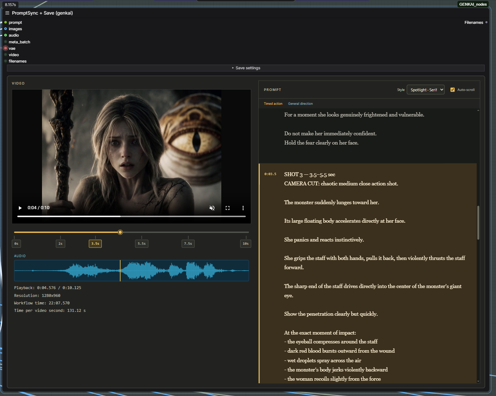
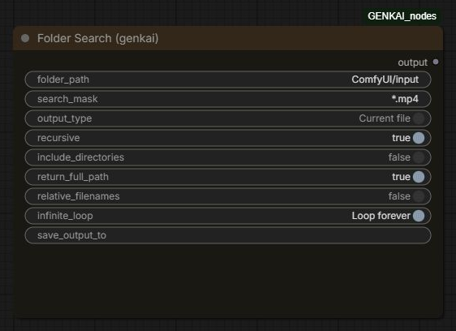
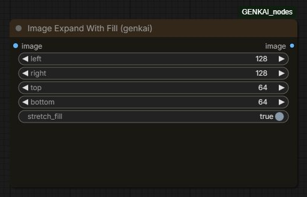

<p align="center">
  <a href="README.md">English</a> &nbsp;|&nbsp; <strong>Русский</strong>
</p>

<h1 align="center">Genkai ComfyUI Nodes</h1>

<p align="center">
  
</p>

<p align="center">
  <a href="https://t.me/genkai_ai"></a>
</p>

## PromptSync

https://github.com/user-attachments/assets/b0ac1e71-b139-49ce-98a5-c3e015adcd86

Просмотрщик для сопоставления сгенерированного видео и промпта с таймингами. Помогает проверить, совпадают ли действия, смены планов и реплики с заданными моментами.

- Слева — видео, таймлайн с кликабельными метками и звуковая волна.
- Справа — исходный промпт с сохранением порядка, пробелов и переносов строк. Markdown остаётся частью исходного текста.
- Текущий временной фрагмент подсвечивается; общие указания по камере, стилю, свету и звуку выделены другим цветом.
- В списке **Style** рядом с **Auto-scroll** можно выбрать оформление. Выбор сохраняется вместе с воркфлоу; стиль можно менять без перезапуска воспроизведения.
- Автопрокрутка следует за воспроизведением; её можно отключить.
- Нажатие на метку времени или звуковую волну перематывает видео.
- Размер ноды можно менять за нижний правый угол, увеличивая пространство для видео и промпта.

[Какие тайминги понимает PromptSync — примеры промптов](#какие-тайминги-понимает-promptsync)

### Стили отображения

Доступны в **обеих версиях PromptSync**:

| Стиль | Отображение |
| --- | --- |
| **Spotlight · Serif** (по умолчанию) | Сплошная тёплая подложка активной сцены, шрифт с засечками и таймкод слева. |
| **Cards · Sans** | Отдельные карточки сцен, шрифт без засечек и золотая рамка активной карточки. |
| **Script · Mono** | Компактный моноширинный текст и голубая подложка активной сцены. |
| **Classic · Inline** | Прежнее оформление со шрифтом с засечками и золотым выделением активных строк. |

Стили меняют оформление, сохраняя исходный текст промпта и его тайминги.

### Подключение

Подайте текст в `prompt` и подключите **один** источник видео:

| Вход | Источник | Поведение |
| --- | --- | --- |
| `video` | Нода, выдающая `VIDEO`, например Load Video | Создаётся временный MP4 для просмотра; используется звук исходного видео. |
| `images` | Последовательность кадров `IMAGE` | Кадры собираются во временный MP4 с частотой `fps`; звук можно подать через `audio`. |
| `filenames` | Выход `Filenames` из VHS Video Combine | Просматривается уже сохранённый видеофайл, без повторного кодирования. |

`fps` применяется только к входу `images`. Отдельный `audio` в этой версии используется при сборке кадров; для `video` и `filenames` воспроизводится звук самого видео.

Звуковая волна строится локально по реальному аудио. Отсутствие аудиодорожки и дорожка с тишиной обозначаются отдельно. Временные файлы могут стать недоступны после очистки папки `temp`.

## PromptSync + Save



Отдельная выходная нода с тем же просмотрщиком и сохранением видео через **VHS Video Combine**.

Включает те же [четыре стиля отображения](#стили-отображения), автопрокрутку и звуковую волну. [Какие тайминги понимает PromptSync — примеры промптов](#какие-тайминги-понимает-promptsync).

Подключите `prompt` и один источник: `images`, `video` или `filenames`. Для латентов на входе `images` подключите `vae`. Вход `audio` добавляет звук к кадрам или заменяет звук исходного видео.

После завершения сохраняется **один итоговый MP4**. Метаданные встраиваются при включённом `save_metadata` (по умолчанию): отдельная PNG с метаданными и промежуточное видео без звука не остаются рядом с результатом. Если у источника нет звука и вход `audio` не подключён, итоговое видео будет без звука.

Выход `Filenames` совместим с `VHS_FILENAMES` и содержит путь только к итоговому видео. Ранее сохранённые результаты не удаляются.

### Просмотр и статистика выполнения

- **Сворачиваемые Save settings:** раскройте параметры кодирования и просмотра, настройте их и спрячьте, чтобы освободить место. Состояние блока сохраняется в воркфлоу.
- **Автозапуск и повтор:** новое видео запускается автоматически. По умолчанию **Repeat preview → Loop** повторяет ролик до ручной паузы; **Once** воспроизводит его один раз. Повтор превью не добавляет повторы в сохраняемый файл.
- **Запоминание громкости:** начальное значение — **25%**. Выбранный уровень сохраняется между генерациями и при сохранении воркфлоу.
- **Sound only on hover:** по умолчанию режим **Hover** включает звук при наведении на превью. Выберите **Always**, чтобы звук продолжался вне превью. Это влияет только на просмотр. Браузер может потребовать первый клик для автозапуска со звуком.
- **Подписанные данные под звуковой дорожкой:** позиция и длительность видео, разрешение, время выполнения всего воркфлоу и затраты на секунду ролика. Шрифт увеличен, выравнивание — слева.

Встроенный таймер считает время от начала выполнения ComfyUI до завершения воркфлоу, включая сохранение, но без ожидания в очереди. **Затраты на секунду видео = время выполнения воркфлоу ÷ длительность видео.** Это замер текущего запуска: использование кэша может ускорить результат; время работы самой модели отдельно не выделяется. Чтобы зафиксировать замер, интерфейс должен оставаться подключённым во время выполнения. Результаты сохраняются вместе с воркфлоу; для старых превью без замера выводится прочерк. Устанавливать отдельную ноду или пак таймера не нужно.

### Настройки сохранения

Нажмите **Save settings** над просмотрщиком, чтобы раскрыть параметры:

| Параметр | Назначение |
| --- | --- |
| `frame_rate` | Частота кадров результата. Для готового видео задайте исходный FPS, чтобы сохранить скорость и соответствие таймингам. |
| `loop_count` | Дополнительные повторы в сохраняемом файле. `0` — без дополнительных повторов; `1` — последовательность проигрывается дважды. |
| `filename_prefix` | Имя и подпапка относительно `output` или `temp`. Поддерживаются шаблоны даты, например `GENKAI/%date:yyyy-MM-dd%/%date:hhmmss%`, при запуске из интерфейса ComfyUI. |
| `format` | MP4 с H.264 или H.265. Для совместимости с браузерным плеером предпочтителен H.264. |
| `pix_fmt` | Формат пикселей: `yuv420p` или `yuv420p10le`; доступность комбинации зависит от кодека и FFmpeg. |
| `crf` | Уровень сжатия: меньшее значение повышает качество и размер файла. По умолчанию — `19`. |
| `save_metadata` | Включено по умолчанию, можно выключить. При включении встраивает доступный workflow, параметры генерации и исходный тайминговый промпт. |
| `trim_to_audio` | Подрезка видео по аудио средствами VHS. |
| `pingpong` | Добавляет обратную последовательность кадров в сохраняемое видео — эффект «бумеранга». Звук не разворачивается. |
| `save_output` | `true` — сохранить в `output`; `false` — сохранить в `temp`. |
| **Sound only on hover** | Звук превью: **Hover** — при наведении (по умолчанию), **Always** — постоянно. |
| **Repeat preview** | Просмотр: **Loop** — повтор (по умолчанию), **Once** — один раз. |

При включённом сохранении метаданных исходный тайминговый промпт записывается как `genkai_timed_prompt`. Готовое видео при сохранении декодируется и кодируется заново. Повторы и `pingpong` меняют длительность, но не переписывают тайминги в тексте автоматически.

### VHS Batch Manager

Вход `meta_batch` предусмотрен для последовательной обработки кадров/латентов. Для него нужны `loop_count=0` и `pingpong=false`.

**Автоматическая постановка следующих частей в очередь требует совместимости со стороны VHS.** В версиях VHS, где `requeue_workflow` в `videohelpersuite/utils.py` считает только выходные ноды `VHS_VideoCombine`, в этот список нужно добавить `GenkaiVideoPromptViewerSave`. Этот репозиторий не изменяет файлы VHS автоматически; обычное сохранение без `meta_batch` такой правки не требует. После обновления VHS совместимость нужно проверить повторно.

## Folder Search



Ищет файлы в выбранной папке и передаёт результаты дальше по воркфлоу. Подходит для последовательной обработки набора изображений, видео или других файлов.

- `folder_path` — папка поиска.
- `search_mask` — маска, например `*.mp4`, `*.png` или `*.*`.
- `output_type` — весь список (`Full file list`) или один путь за выполнение (`Current file`).
- `recursive` — поиск во вложенных папках.
- `include_directories` — включение папок в результаты.
- `return_full_path` — выдача полного пути.
- `relative_filenames` — путь относительно папки поиска, если полный путь выключен.
- `infinite_loop` — после последнего файла сразу вернуться к первому в режиме по одному файлу.
- `save_output_to` — необязательный текстовый файл для записи найденных путей.

Выход `output` содержит список или строку в зависимости от режима. Без `infinite_loop` после последнего результата возвращается пустая строка; следующий запуск начинает новый проход. Нода выдаёт следующий файл при очередном выполнении, но сама не запускает очередь ComfyUI. Порядок результатов соответствует обходу файловой системы, без дополнительной сортировки.

## Image Expand With Fill



Увеличивает холст, добавляя указанное число пикселей слева (`left`), справа (`right`), сверху (`top`) и снизу (`bottom`). Работает с одиночным изображением и пачкой `IMAGE`.

- `stretch_fill=true` — продолжает крайние пиксели изображения наружу.
- `stretch_fill=false` — заполняет добавленную область нулями: для обычного RGB-изображения это чёрные поля.
- Выход `image` — изображение с расширенным холстом.

Исходная область не масштабируется. Нода не выполняет генеративный outpainting и не дорисовывает новые детали. При расширении используется преобразование через 8-битное изображение; при нулевых полях вход возвращается без этого преобразования.

## Установка

В папке `ComfyUI/custom_nodes` выполните:

```bash
git clone https://github.com/GENKAIx/Genkai-ComfyUI-Nodes.git
```

Перезапустите ComfyUI и обновите страницу браузера через **Ctrl+F5**. Ноды доступны через поиск по названию; просмотрщики находятся в категории `GENKAI/Video`, остальные — в `GENKAI nodes`.

Используйте актуальную установку ComfyUI с поддержкой типа `VIDEO` и `comfy_api.latest`. Пак использует библиотеки среды ComfyUI: PyTorch, NumPy, PyAV и aiohttp.

Для **PromptSync + Save** дополнительно установите [ComfyUI-VideoHelperSuite](https://github.com/Kosinkadink/ComfyUI-VideoHelperSuite) и его зависимости. Кодирование выполняет VHS Video Combine; FFmpeg должен поддерживать выбранный кодек. Для обычного PromptSync VHS нужен только при использовании источника `VHS_FILENAMES`.

Если пак уже установлен под именем `GENKAI_nodes`, обновляйте существующую установку или замените её новой. Не оставляйте одновременно две активные копии: у них одинаковые идентификаторы нод.

## Какие тайминги понимает PromptSync

Обе версии используют один разборщик. Он распознаёт распространённые текстовые структуры промптов MiniMax H3, Seedance и других генераторов по явным временным меткам, независимо от названия модели.

Примеры поддерживаемой записи:

```text
0.0–2.5 sec: A character enters the room.
2.5–6.0 sec: The camera moves closer.

Camera:
Soft cinematic light, slow movement.
```

```text
SHOT 1 (00:00–00:04) — Opening
A flame appears.

SHOT 2 (00:04–00:08) — Orbit
The camera circles the character.
```

```json
[
  {"start": 0, "end": 4, "prompt": "A flame appears."},
  {"start_time": "00:04", "duration": 4, "prompt": "The camera circles the character."}
]
```

Также поддерживаются метки `MM:SS` и `HH:MM:SS`, десятичные секунды с точкой или запятой, Markdown-заголовки и таблицы, нумерованные сцены, конструкции `At` / `From`, блоки H3 `[Shot N]` и JSON-поля `timestamp` / `time_range`.

Общие разделы вроде `Camera`, `Lighting`, `Style`, `Effects`, `Audio`, `overall_soundscape` и `non_diegetic_music` отделяются от сцен по структуре текста. Для предсказуемого результата начинайте общий раздел после пустой строки, на том же уровне отступа, что и заголовки сцен. Указания с отступом внутри сцены остаются частью сцены.

Разбор основан на правилах: двусмысленный текст без явных границ может быть распознан неточно. Название модели само по себе не гарантирует поддержку любого её промпта. Промпт без таймингов отображается целиком, без выдуманных временных отрезков.

## Обновление и устранение проблем

В папке установленного пака выполните `git pull`, перезапустите ComfyUI и обновите браузер через **Ctrl+F5**.

- **NaN или сдвинутые поля после открытия старой схемы:** текущая версия исправляет сериализацию параметров. Если прежние значения уже потеряны, они сбрасываются к стандартным с уведомлением; проверьте FPS, имя файла и параметры кодирования перед запуском.
- **Видео не воспроизводится:** попробуйте H.264 с `yuv420p` и проверьте, что исходный файл ещё существует.
- **Звуковая волна отсутствует:** убедитесь, что итоговое видео содержит аудиодорожку.
- **Ошибка источника:** подключайте только один из входов `images`, `video`, `filenames`.
- **Ошибка сохранения:** проверьте установку VideoHelperSuite, доступность выбранного кодека и путь `filename_prefix` внутри `output`/`temp`.

Подробнее о просмотрщиках на английском: [PromptSync technical notes](README_VideoPromptViewer.md).

## Используемые проекты

- [ComfyUI](https://github.com/Comfy-Org/ComfyUI) — среда выполнения, граф и типы данных.
- [ComfyUI-VideoHelperSuite](https://github.com/Kosinkadink/ComfyUI-VideoHelperSuite) — кодирование видео для PromptSync + Save.

Автор пака: **GENKAI** · [GitHub](https://github.com/GENKAIx)
